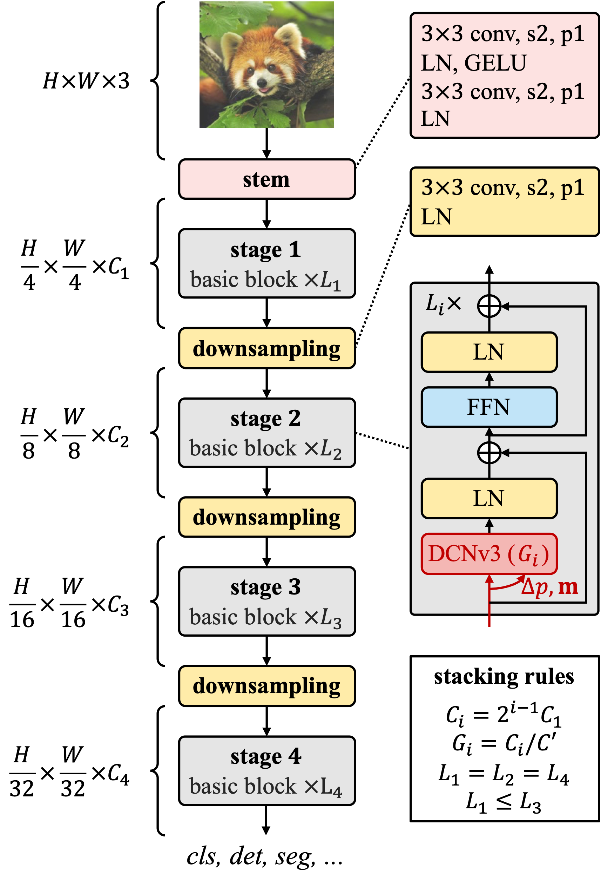

# InternImage

[](https://paperswithcode.com/sota/object-detection-on-coco?p=internimage-exploring-large-scale-vision)
[](https://paperswithcode.com/sota/object-detection-on-coco-minival?p=internimage-exploring-large-scale-vision)
[](https://paperswithcode.com/sota/object-detection-on-lvis-v1-0-minival?p=internimage-exploring-large-scale-vision)
[](https://paperswithcode.com/sota/object-detection-on-lvis-v1-0-val?p=internimage-exploring-large-scale-vision)
[](https://paperswithcode.com/sota/object-detection-on-pascal-voc-2007?p=internimage-exploring-large-scale-vision)
[](https://paperswithcode.com/sota/object-detection-on-pascal-voc-2012?p=internimage-exploring-large-scale-vision)
[](https://paperswithcode.com/sota/object-detection-on-openimages-v6?p=internimage-exploring-large-scale-vision)
[](https://paperswithcode.com/sota/object-detection-on-crowdhuman-full-body?p=internimage-exploring-large-scale-vision)
[](https://paperswithcode.com/sota/semantic-segmentation-on-ade20k?p=internimage-exploring-large-scale-vision)
[](https://paperswithcode.com/sota/semantic-segmentation-on-pascal-context?p=internimage-exploring-large-scale-vision)
[](https://paperswithcode.com/sota/semantic-segmentation-on-coco-stuff-test?p=internimage-exploring-large-scale-vision)
[](https://paperswithcode.com/sota/3d-object-detection-on-nuscenes-camera-only?p=bevformer-v2-adapting-modern-image-backbones)
[](https://paperswithcode.com/sota/image-classification-on-inaturalist-2018?p=internimage-exploring-large-scale-vision)
[](https://paperswithcode.com/sota/image-classification-on-places365?p=internimage-exploring-large-scale-vision)
[](https://paperswithcode.com/sota/image-classification-on-places205?p=internimage-exploring-large-scale-vision)
[](https://paperswithcode.com/sota/2d-object-detection-on-bdd100k-val?p=internimage-exploring-large-scale-vision)
[](https://paperswithcode.com/sota/image-classification-on-imagenet?p=internimage-exploring-large-scale-vision)

This repository is an official implementation of the [InternImage: Exploring Large-Scale Vision Foundation Models with
Deformable Convolutions](https://arxiv.org/abs/2211.05778).

[Paper](https://arxiv.org/abs/2211.05778) \| [Blog in Chinese](https://zhuanlan.zhihu.com/p/610772005) | [Documents](./docs/)

## News
- `Feb 28, 2023`: InternImage is accepted to CVPR 2023!
- `Nov 18, 2022`: 🚀 InternImage-XL merged into [BEVFormer v2](https://arxiv.org/abs/2211.10439) achieves state-of-the-art performance of `63.4 NDS` on nuScenes Camera Only.
- `Nov 10, 2022`: 🚀🚀 InternImage-H achieves a new record `65.4 mAP` on COCO detection test-dev and `62.9 mIoU` on
ADE20K, outperforming previous models by a large margin.

## Coming soon
- [ ] Other downstream tasks. 
- [x] TensorRT inference. 
- [x] Classification code of the InternImage series.
- [x] InternImage-T/S/B/L/XL ImageNet-1k pretrained model.
- [x] InternImage-L/XL ImageNet-22k pretrained model.
- [x] InternImage-T/S/B/L/XL detection and instance segmentation model.
- [x] InternImage-T/S/B/L/XL semantic segmentation model.

## Introduction

**InternImage**, initially described in [arxiv](https://arxiv.org/abs/2211.05778), can be a general backbone for computer vision.
It takes deformable convolution as the core operator to obtain large effective receptive fields, and introducing adaptive spatial aggregation
to reduces the strict inductive bias. Our model makes it possible to learn more stronger and robust models with large-scale parameters from massive data.

<div align=center>

</div>

## Main Results on ImageNet with Pretrained Models

**ImageNet-1K and ImageNet-22K Pretrained InternImage Models**

|      name      |   pretrain   | resolution | acc@1 | #params | FLOPs |      22K model      |      1K model       |
| :------------: | :----------: | :--------: | :---: | :-----: | :---: | :-----------------: | :-----------------: |
| InternImage-T  | ImageNet-1K  |  224x224   | 83.5  |   30M   |  5G   |          -          | [ckpt](https://github.com/OpenGVLab/InternImage/releases/download/cls_model/internimage_t_1k_224.pth) \| [cfg](classification/configs/internimage_t_1k_224.yaml) |
| InternImage-S  | ImageNet-1K  |  224x224   | 84.2  |   50M   |  8G   |          -          | [ckpt](https://github.com/OpenGVLab/InternImage/releases/download/cls_model/internimage_s_1k_224.pth) \| [cfg](classification/configs/internimage_s_1k_224.yaml) |
| InternImage-B  | ImageNet-1K  |  224x224   | 84.9  |   97M   |  16G  |          -          | [ckpt](https://github.com/OpenGVLab/InternImage/releases/download/cls_model/internimage_b_1k_224.pth) \| [cfg](classification/configs/internimage_b_1k_224.yaml) |
| InternImage-L  | ImageNet-22K |  384x384   | 87.7  |  223M   | 108G  | [ckpt](https://github.com/OpenGVLab/InternImage/releases/download/cls_model/internimage_l_22k_192to384.pth)            | [ckpt](https://github.com/OpenGVLab/InternImage/releases/download/cls_model/internimage_l_22kto1k_384.pth) \| [cfg](classification/configs/internimage_l_22kto1k_384.yaml) |
| InternImage-XL | ImageNet-22K |  384x384   | 88.0  |  335M   | 163G  | [ckpt](https://github.com/OpenGVLab/InternImage/releases/download/cls_model/internimage_xl_22k_192to384.pth)            | [ckpt](https://github.com/OpenGVLab/InternImage/releases/download/cls_model/internimage_xl_22kto1k_384.pth) \| [cfg](classification/configs/internimage_xl_22kto1k_384.yaml) |

## Main Results on Downstream Tasks

**COCO Object Detection**

|    backbone    |       method       | schd | box mAP | mask mAP | #params | FLOPs | Download | 
| :------------: | :----------------: | :---------: | :-----: | :------: | :-----: | :---: | :---: | 
| InternImage-T  |     Mask R-CNN     |     1x      |  47.2   |   42.5   |   49M   | 270G  |  [ckpt](https://github.com/OpenGVLab/InternImage/releases/download/det_model/mask_rcnn_internimage_t_fpn_1x_coco.pth) \| [cfg](detection/configs/mask_rcnn/mask_rcnn_internimage_t_fpn_1x_coco.py) |
| InternImage-T  |     Mask R-CNN     |     3x      |  49.1   |   43.7   |   49M   | 270G  |  [ckpt](https://github.com/OpenGVLab/InternImage/releases/download/det_model/mask_rcnn_internimage_t_fpn_3x_coco.pth) \| [cfg](detection/configs/mask_rcnn/mask_rcnn_internimage_t_fpn_3x_coco.py) |
| InternImage-S  |     Mask R-CNN     |     1x      |  47.8   |   43.3   |   69M   | 340G  |  [ckpt](https://github.com/OpenGVLab/InternImage/releases/download/det_model/mask_rcnn_internimage_s_fpn_1x_coco.pth) \| [cfg](detection/configs/mask_rcnn/mask_rcnn_internimage_s_fpn_1x_coco.py) |
| InternImage-S  |     Mask R-CNN     |     3x      |  49.7   |   44.5   |   69M   | 340G  |  [ckpt](https://github.com/OpenGVLab/InternImage/releases/download/det_model/mask_rcnn_internimage_s_fpn_3x_coco.pth) \| [cfg](detection/configs/mask_rcnn/mask_rcnn_internimage_s_fpn_3x_coco.py) |
| InternImage-B  |     Mask R-CNN     |     1x      |  48.8   |   44.0   |  115M   | 501G  |  [ckpt](https://github.com/OpenGVLab/InternImage/releases/download/det_model/mask_rcnn_internimage_b_fpn_1x_coco.pth) \| [cfg](detection/configs/mask_rcnn/mask_rcnn_internimage_b_fpn_1x_coco.py) |
| InternImage-B  |     Mask R-CNN     |     3x      |  50.3   |   44.8   |  115M   | 501G  |  [ckpt](https://github.com/OpenGVLab/InternImage/releases/download/det_model/mask_rcnn_internimage_b_fpn_3x_coco.pth) \| [cfg](detection/configs/mask_rcnn/mask_rcnn_internimage_b_fpn_3x_coco.py) |
| InternImage-L  |     Cascade        |     1x      |  54.9   |   47.7   |  277M   | 1399G |  [ckpt](https://github.com/OpenGVLab/InternImage/releases/download/det_model/cascade_internimage_l_fpn_1x_coco.pth) \| [cfg](detection/configs/cascade_mask_rcnn/cascade_internimage_l_fpn_1x_coco.py) |
| InternImage-L  |     Cascade        |     3x      |  56.1   |   48.5   |  277M   | 1399G |  [ckpt](https://github.com/OpenGVLab/InternImage/releases/download/det_model/cascade_internimage_l_fpn_3x_coco.pth) \| [cfg](detection/configs/cascade_mask_rcnn/cascade_internimage_l_fpn_3x_coco.py) |
| InternImage-XL |     Cascade        |     1x      |  55.3   |   48.1   |  387M   | 1782G |  [ckpt](https://github.com/OpenGVLab/InternImage/releases/download/det_model/cascade_internimage_xl_fpn_1x_coco.pth) \| [cfg](detection/configs/cascade_mask_rcnn/cascade_internimage_xl_fpn_1x_coco.py) |
| InternImage-XL |     Cascade        |     3x      |  56.2   |   48.8   |  387M   | 1782G |  [ckpt](https://github.com/OpenGVLab/InternImage/releases/download/det_model/cascade_internimage_xl_fpn_1x_coco.pth) \| [cfg](detection/configs/cascade_mask_rcnn/cascade_internimage_xl_fpn_3x_coco.py) |

**ADE20K Semantic Segmentation**

|    backbone    | resolution | single scale | multi scale | #params | FLOPs | Download | 
| :------------: | :--------: | :----------: | :---------: | :-----: | :---: |   :---:  |
| InternImage-T  |  512x512   |     47.9     |    48.1     |   59M   | 944G  | [ckpt](https://github.com/OpenGVLab/InternImage/releases/download/seg_models/upernet_internimage_t_512_160k_ade20k.pth) \| [cfg](segmentation/configs/upernet/upernet_internimage_t_512_160k_ade20k.py) |
| InternImage-S  |  512x512   |     50.1     |    50.9     |   80M   | 1017G | [ckpt](https://github.com/OpenGVLab/InternImage/releases/download/seg_models/upernet_internimage_s_512_160k_ade20k.pth) \| [cfg](segmentation/configs/upernet/upernet_internimage_s_512_160k_ade20k.py) |
| InternImage-B  |  512x512   |     50.8     |    51.3     |  128M   | 1185G | [ckpt](https://github.com/OpenGVLab/InternImage/releases/download/seg_models/upernet_internimage_b_512_160k_ade20k.pth) \| [cfg](segmentation/configs/upernet/upernet_internimage_b_512_160k_ade20k.py) |
| InternImage-L  |  640x640   |     53.9     |    54.1     |  256M   | 2526G | [ckpt](https://github.com/OpenGVLab/InternImage/releases/download/seg_models/upernet_internimage_l_640_160k_ade20k.pth) \| [cfg](segmentation/configs/upernet/upernet_internimage_l_640_160k_ade20k.py) |
| InternImage-XL |  640x640   |     55.0     |    55.3     |  368M   | 3142G | [ckpt](https://github.com/OpenGVLab/InternImage/releases/download/seg_models/upernet_internimage_xl_640_160k_ade20k.pth) \| [cfg](segmentation/configs/upernet/upernet_internimage_xl_640_160k_ade20k.py) |

## Main Results of FPS

|      name      | resolution | #params | FLOPs | Batch 1 FPS(TensorRT) |
| :------------: | :--------: | :-----: | :---: | :-------------------: |
| InternImage-T  |  224x224   |   30M   |  5G   |          156          |
| InternImage-S  |  224x224   |   50M   |  8G   |          129          |
| InternImage-B  |  224x224   |   97M   |  16G  |          116          |
| InternImage-L  |  384x384   |  223M   | 108G  |          56           |
| InternImage-XL |  384x384   |  335M   | 163G  |          47           |

## Citation

If this work is helpful for your research, please consider citing the following BibTeX entry.

```
@article{wang2022internimage,
  title={InternImage: Exploring Large-Scale Vision Foundation Models with Deformable Convolutions},
  author={Wang, Wenhai and Dai, Jifeng and Chen, Zhe and Huang, Zhenhang and Li, Zhiqi and Zhu, Xizhou and Hu, Xiaowei and Lu, Tong and Lu, Lewei and Li, Hongsheng and others},
  journal={arXiv preprint arXiv:2211.05778},
  year={2022}
}
```
