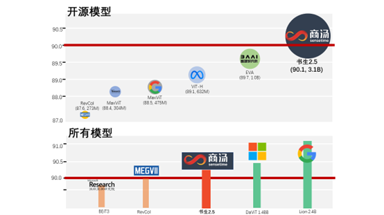
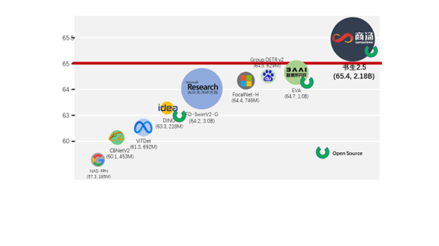
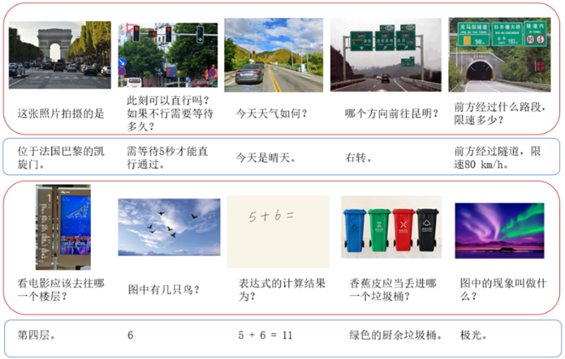
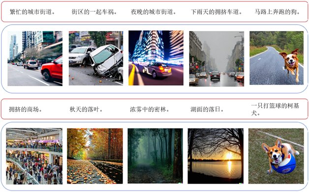
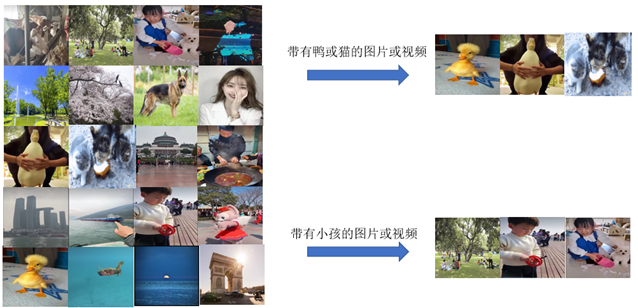
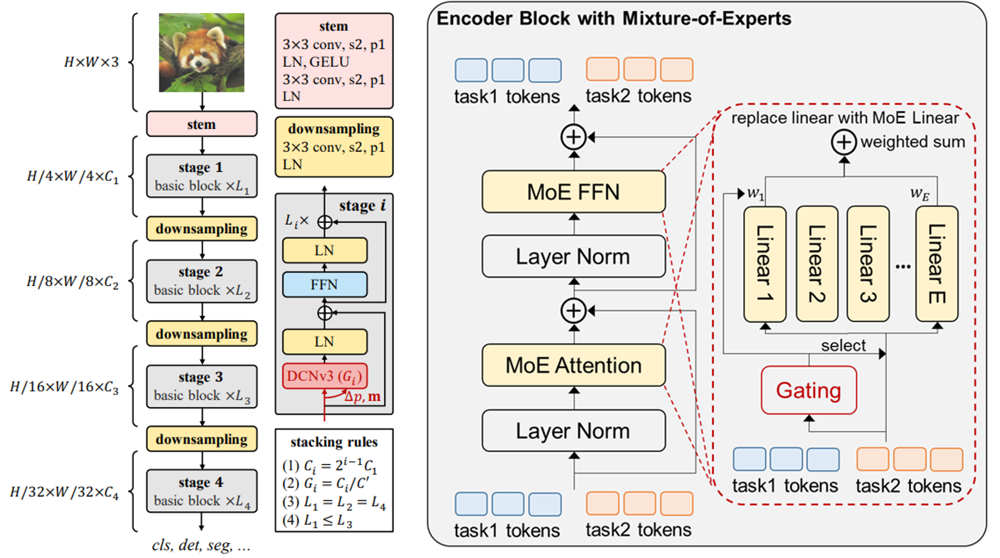

# InternImage

[](https://paperswithcode.com/sota/object-detection-on-coco?p=internimage-exploring-large-scale-vision)
[](https://paperswithcode.com/sota/object-detection-on-coco-minival?p=internimage-exploring-large-scale-vision)
[](https://paperswithcode.com/sota/object-detection-on-lvis-v1-0-minival?p=internimage-exploring-large-scale-vision)
[](https://paperswithcode.com/sota/object-detection-on-lvis-v1-0-val?p=internimage-exploring-large-scale-vision)
[](https://paperswithcode.com/sota/object-detection-on-pascal-voc-2007?p=internimage-exploring-large-scale-vision)
[](https://paperswithcode.com/sota/object-detection-on-pascal-voc-2012?p=internimage-exploring-large-scale-vision)
[](https://paperswithcode.com/sota/object-detection-on-openimages-v6?p=internimage-exploring-large-scale-vision)
[](https://paperswithcode.com/sota/object-detection-on-crowdhuman-full-body?p=internimage-exploring-large-scale-vision)
[](https://paperswithcode.com/sota/semantic-segmentation-on-ade20k?p=internimage-exploring-large-scale-vision)
[](https://paperswithcode.com/sota/semantic-segmentation-on-pascal-context?p=internimage-exploring-large-scale-vision)
[](https://paperswithcode.com/sota/semantic-segmentation-on-coco-stuff-test?p=internimage-exploring-large-scale-vision)
[](https://paperswithcode.com/sota/3d-object-detection-on-nuscenes-camera-only?p=bevformer-v2-adapting-modern-image-backbones)
[](https://paperswithcode.com/sota/image-classification-on-inaturalist-2018?p=internimage-exploring-large-scale-vision)
[](https://paperswithcode.com/sota/image-classification-on-places365?p=internimage-exploring-large-scale-vision)
[](https://paperswithcode.com/sota/image-classification-on-places205?p=internimage-exploring-large-scale-vision)
[](https://paperswithcode.com/sota/2d-object-detection-on-bdd100k-val?p=internimage-exploring-large-scale-vision)
[](https://paperswithcode.com/sota/image-classification-on-imagenet?p=internimage-exploring-large-scale-vision)

This repository is an official implementation of the [InternImage: Exploring Large-Scale Vision Foundation Models with
Deformable Convolutions](https://arxiv.org/abs/2211.05778).

[Paper](https://arxiv.org/abs/2211.05778) \| [Blog in Chinese](https://zhuanlan.zhihu.com/p/610772005)


## 书生2.5
### 简介
商汤科技与上海实验室在2023年3月14日联合发布多模态多任务通用模型“书生2.5”，在多模态多任务处理能力中斩获多项全新突破，其卓越的图文跨模态任务处理能力可为自动驾驶等通用场景任务提供高效精准的感知和理解能力支持。

### 亮点
“书生2.5”包含拥有高达30亿参数的最强视觉通用主干模型，不仅是世界上开源模型中ImageNet准确度最高、规模最大的模型，也是物体检测标杆数据集COCO中唯一超过65.0 mAP的模型。

#### ImageNet
在视觉主流图像分类数据集ImageNet上，“书生2.5”仅基于公开数据便达到了90.1%的Top-1准确率。这是除谷歌与微软两个未公开模型及额外数据集外，唯一准确率超过90.0%的模型，同时也是世界上开源模型中ImageNet准确度最高，规模最大的模型。

<div align=center>

</div>

#### COCO
在物体检测标杆数据集COCO上，“书生2.5”取得了65.4的mAP，是世界上唯一超过65.0mAP的模型，已经大幅领先谷歌和微软。
<div align=center>

</div>

### 图文跨模态应用

“书生2.5”多模态多任务通用模型当前专注于图文跨模态任务，模型无需微调，便可灵活、精准地应对各式任务，并在“以图生文、以文生图和图文检索”等图文跨模态任务上都取得了令人印象深刻的表现。

#### 以图生文

“以图生文”是视觉感知中的一类任务，可根据给定图像和提示性语句，作出相应的文本作答。“书生2.5”的“以图生文”在图像描述、视觉问答、视觉推理和文字识别等多个方面均拥有强大的理解能力。例如在自动驾驶场景下，可以大幅提升场景感知理解能力，高效准确地辅助车辆判断交通信号灯状态、道路标志牌等信息，为车辆的决策规划提供有效的感知信息支持。

<div align=center>

</div>

#### 以文生图

“以文生图”是人工智能生成内容（AIGC, AI Generated Content）的重要方向。“书生2.5”的“以文生图”能力，可根据用户提出的文本创作需求，利用扩散模型生成算法，精准地生成满足需求的高质量、自然的写实图像。例如，针对自动驾驶等数据依赖场景，“书生2.5”可以生成各类真实的道路交通场景，如繁忙的城市街道、雨天拥挤的车道、马路上奔跑的狗等，从而辅助自动驾驶系统的研发，不断提高Corner Case场景的感知能力上限。
<div align=center>

</div>


#### 图文检索

“图文检索”可以根据文本内容检索出语义最相关的图像。“书生2.5”的“图文检索”能力既可应用于视频和图像集合，也可进一步结合物体检测框，具有丰富的应用模式，帮助用户更便捷、更快速地找到所需的图像资源。

<div align=center>

</div>


## 核心技术
“书生2.5”在图文跨模态领域卓越的性能表现，源自于在多模态多任务通用模型技术核心方面的多项创新，实现了视觉核心视觉感知大模型主干网络（InternImage）、用于文本核心的超大规模文本预训练网络（LLM）和用于多任务的兼容解码建模（Uni-Perceiver）的创新组合。

视觉主干网络InternImage参数量高达30亿，能够基于动态稀疏卷积算子自适应地调整卷积的位置和组合方式，从而为多功能视觉感知提供强大的表示。Uni-Perceiver通才任务解码建模通过将不同模态的数据编码到统一的表示空间，并将不同任务统一为相同的任务范式，从而能够以相同的任务架构和共享的模型参数同时处理各种模态和任务。


<div align=center>

</div>

## 最新进展
- 2023年3月14日: 🚀 书生2.5发布！
- 2023年2月28日: 🚀 InternImage被CVPR 2023接收!
- 2022年11月18日: 🚀 基于InternImage-XL主干网络，[BEVFormer v2](https://arxiv.org/abs/2211.10439) 在nuScenes的纯视觉3D检测任务上取得了最佳性能63.4NDS！
- 2022年11月10日: 🚀 InternImage-H在COCO目标检测任务上以 65.4mAP 斩获冠军，是唯一突破 65mAP 的超强物体检测模型。
- 2022年11月10日: 🚀 InternImage-H在ADE20k语义分割数据集上取得62.9 mIoU的性能，大幅领先同期模型！


## 开源功能
- [Coming] InternImage-H(1B)/G(3B)
- [Coming] 各类downstream tasks
- TensorRT 推理
- InternImage系列分类代码
- InternImage-T/S/B/L/XL ImageNet-1k 预训练模型
- InternImage-L/XL ImageNet-22k 预训练模型
- InternImage-T/S/B/L/XL 检测和实例分割模型
- InternImage-T/S/B/L/XL语义分割模型


## InterImage介绍
InterImage网络采用可变形卷积作为核心算子，可以自适应地调整卷积的位置和组合方式，从而为多功能视觉感知提供强大的表示。我们的模型使得从海量数据中学习更强大和鲁棒的大规模参数模型成为可能，其可以作为计算机视觉任务的通用主干网络，从而可以支撑各类计算机视觉任务。


## 视觉任务性能

**ImageNet图像分类**

|      name      |   pretrain   | resolution | acc@1 | #param | FLOPs |      22K model      |      1K model       |
| :------------: | :----------: | :--------: | :---: | :-----: | :---: | :-----------------: | :-----------------: |
| InternImage-T  | ImageNet-1K  |  224x224   | 83.5  |   30M   |  5G   |          -          | [ckpt](https://github.com/OpenGVLab/InternImage/releases/download/cls_model/internimage_t_1k_224.pth) \| [cfg](classification/configs/internimage_t_1k_224.yaml) |
| InternImage-S  | ImageNet-1K  |  224x224   | 84.2  |   50M   |  8G   |          -          | [ckpt](https://github.com/OpenGVLab/InternImage/releases/download/cls_model/internimage_s_1k_224.pth) \| [cfg](classification/configs/internimage_s_1k_224.yaml) |
| InternImage-B  | ImageNet-1K  |  224x224   | 84.9  |   97M   |  16G  |          -          | [ckpt](https://github.com/OpenGVLab/InternImage/releases/download/cls_model/internimage_b_1k_224.pth) \| [cfg](classification/configs/internimage_b_1k_224.yaml) |
| InternImage-L  | ImageNet-22K |  384x384   | 87.7  |  223M   | 108G  | [ckpt](https://github.com/OpenGVLab/InternImage/releases/download/cls_model/internimage_l_22k_192to384.pth)            | [ckpt](https://github.com/OpenGVLab/InternImage/releases/download/cls_model/internimage_l_22kto1k_384.pth) \| [cfg](classification/configs/internimage_l_22kto1k_384.yaml) |
| InternImage-XL | ImageNet-22K |  384x384   | 88.0  |  335M   | 163G  | [ckpt](https://github.com/OpenGVLab/InternImage/releases/download/cls_model/internimage_xl_22k_192to384.pth)            | [ckpt](https://github.com/OpenGVLab/InternImage/releases/download/cls_model/internimage_xl_22kto1k_384.pth) \| [cfg](classification/configs/internimage_xl_22kto1k_384.yaml) |
| InternImage-H | ImageNet-22K |  224x224   | 88.9  |  1.08B   | 188G  | -         | - |
| InternImage-H | ImageNet-22K |  640x640   | 89.6  |  1.08B   | 1478G  |-           | - |
| InternImage-G | ImageNet-22K |  640x640   | 90.1  |  3B   | -  |  -       | -|

**COCO目标检测和实例分割**

|    backbone    |       method       | schd | box mAP | mask mAP | #param | FLOPs | Download | 
| :------------: | :----------------: | :---------: | :-----: | :------: | :-----: | :---: | :---: | 
| InternImage-T  |     Mask R-CNN     |     1x      |  47.2   |   42.5   |   49M   | 270G  |  [ckpt](https://github.com/OpenGVLab/InternImage/releases/download/det_model/mask_rcnn_internimage_t_fpn_1x_coco.pth) \| [cfg](detection/configs/mask_rcnn/mask_rcnn_internimage_t_fpn_1x_coco.py) |
| InternImage-T  |     Mask R-CNN     |     3x      |  49.1   |   43.7   |   49M   | 270G  |  [ckpt](https://github.com/OpenGVLab/InternImage/releases/download/det_model/mask_rcnn_internimage_t_fpn_3x_coco.pth) \| [cfg](detection/configs/mask_rcnn/mask_rcnn_internimage_t_fpn_3x_coco.py) |
| InternImage-S  |     Mask R-CNN     |     1x      |  47.8   |   43.3   |   69M   | 340G  |  [ckpt](https://github.com/OpenGVLab/InternImage/releases/download/det_model/mask_rcnn_internimage_s_fpn_1x_coco.pth) \| [cfg](detection/configs/mask_rcnn/mask_rcnn_internimage_s_fpn_1x_coco.py) |
| InternImage-S  |     Mask R-CNN     |     3x      |  49.7   |   44.5   |   69M   | 340G  |  [ckpt](https://github.com/OpenGVLab/InternImage/releases/download/det_model/mask_rcnn_internimage_s_fpn_3x_coco.pth) \| [cfg](detection/configs/mask_rcnn/mask_rcnn_internimage_s_fpn_3x_coco.py) |
| InternImage-B  |     Mask R-CNN     |     1x      |  48.8   |   44.0   |  115M   | 501G  |  [ckpt](https://github.com/OpenGVLab/InternImage/releases/download/det_model/mask_rcnn_internimage_b_fpn_1x_coco.pth) \| [cfg](detection/configs/mask_rcnn/mask_rcnn_internimage_b_fpn_1x_coco.py) |
| InternImage-B  |     Mask R-CNN     |     3x      |  50.3   |   44.8   |  115M   | 501G  |  [ckpt](https://github.com/OpenGVLab/InternImage/releases/download/det_model/mask_rcnn_internimage_b_fpn_3x_coco.pth) \| [cfg](detection/configs/mask_rcnn/mask_rcnn_internimage_b_fpn_3x_coco.py) |
| InternImage-L  |     Cascade        |     1x      |  54.9   |   47.7   |  277M   | 1399G |  [ckpt](https://github.com/OpenGVLab/InternImage/releases/download/det_model/cascade_internimage_l_fpn_1x_coco.pth) \| [cfg](detection/configs/cascade_mask_rcnn/cascade_internimage_l_fpn_1x_coco.py) |
| InternImage-L  |     Cascade        |     3x      |  56.1   |   48.5   |  277M   | 1399G |  [ckpt](https://github.com/OpenGVLab/InternImage/releases/download/det_model/cascade_internimage_l_fpn_3x_coco.pth) \| [cfg](detection/configs/cascade_mask_rcnn/cascade_internimage_l_fpn_3x_coco.py) |
| InternImage-XL |     Cascade        |     1x      |  55.3   |   48.1   |  387M   | 1782G |  [ckpt](https://github.com/OpenGVLab/InternImage/releases/download/det_model/cascade_internimage_xl_fpn_1x_coco.pth) \| [cfg](detection/configs/cascade_mask_rcnn/cascade_internimage_xl_fpn_1x_coco.py) |
| InternImage-XL |     Cascade        |     3x      |  56.2   |   48.8   |  387M   | 1782G |  [ckpt](https://github.com/OpenGVLab/InternImage/releases/download/det_model/cascade_internimage_xl_fpn_1x_coco.pth) \| [cfg](detection/configs/cascade_mask_rcnn/cascade_internimage_xl_fpn_3x_coco.py) |
| InternImage-H |     DINO        |     3x      |  65.0   |   -   |  2.18B   | - |  - |

**ADE20K语义分割**

|    backbone    | resolution | single scale | multi scale | #param | FLOPs | Download | 
| :------------: | :--------: | :----------: | :---------: | :-----: | :---: |   :---:  |
| InternImage-T  |  512x512   |     47.9     |    48.1     |   59M   | 944G  | [ckpt](https://github.com/OpenGVLab/InternImage/releases/download/seg_models/upernet_internimage_t_512_160k_ade20k.pth) \| [cfg](segmentation/configs/upernet/upernet_internimage_t_512_160k_ade20k.py) |
| InternImage-S  |  512x512   |     50.1     |    50.9     |   80M   | 1017G | [ckpt](https://github.com/OpenGVLab/InternImage/releases/download/seg_models/upernet_internimage_s_512_160k_ade20k.pth) \| [cfg](segmentation/configs/upernet/upernet_internimage_s_512_160k_ade20k.py) |
| InternImage-B  |  512x512   |     50.8     |    51.3     |  128M   | 1185G | [ckpt](https://github.com/OpenGVLab/InternImage/releases/download/seg_models/upernet_internimage_b_512_160k_ade20k.pth) \| [cfg](segmentation/configs/upernet/upernet_internimage_b_512_160k_ade20k.py) |
| InternImage-L  |  640x640   |     53.9     |    54.1     |  256M   | 2526G | [ckpt](https://github.com/OpenGVLab/InternImage/releases/download/seg_models/upernet_internimage_l_640_160k_ade20k.pth) \| [cfg](segmentation/configs/upernet/upernet_internimage_l_640_160k_ade20k.py) |
| InternImage-XL |  640x640   |     55.0     |    55.3     |  368M   | 3142G | [ckpt](https://github.com/OpenGVLab/InternImage/releases/download/seg_models/upernet_internimage_xl_640_160k_ade20k.pth) \| [cfg](segmentation/configs/upernet/upernet_internimage_xl_640_160k_ade20k.py) |
| InternImage-H |  896x896   |     59.9     |    60.3     |  1.12B   | 3566G | - |
## 模型推理速度

|      name      | resolution | #params | FLOPs | Batch 1 FPS(TensorRT) |
| :------------: | :--------: | :-----: | :---: | :-------------------: |
| InternImage-T  |  224x224   |   30M   |  5G   |          156          |
| InternImage-S  |  224x224   |   50M   |  8G   |          129          |
| InternImage-B  |  224x224   |   97M   |  16G  |          116          |
| InternImage-L  |  384x384   |  223M   | 108G  |          56           |
| InternImage-XL |  384x384   |  335M   | 163G  |          47           |


## 引用

若你在研究中使用了“书生2.5”，请参考如下bibtex对我们的工作进行引用。

```
@article{wang2022internimage,
  title={InternImage: Exploring Large-Scale Vision Foundation Models with Deformable Convolutions},
  author={Wang, Wenhai and Dai, Jifeng and Chen, Zhe and Huang, Zhenhang and Li, Zhiqi and Zhu, Xizhou and Hu, Xiaowei and Lu, Tong and Lu, Lewei and Li, Hongsheng and others},
  journal={arXiv preprint arXiv:2211.05778},
  year={2022}
}
```
