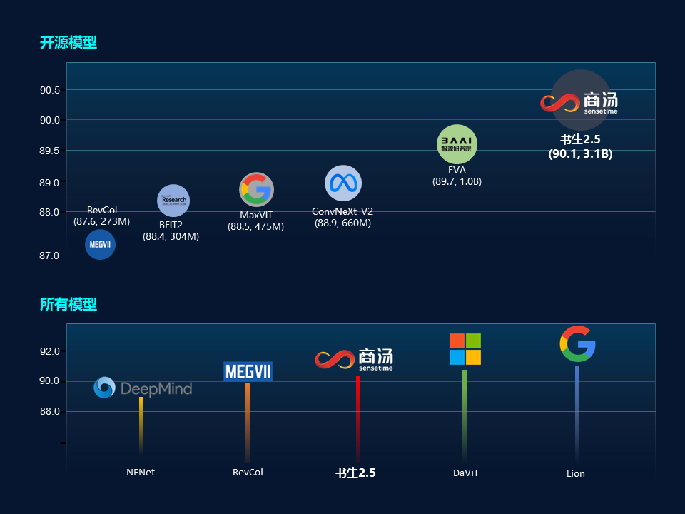
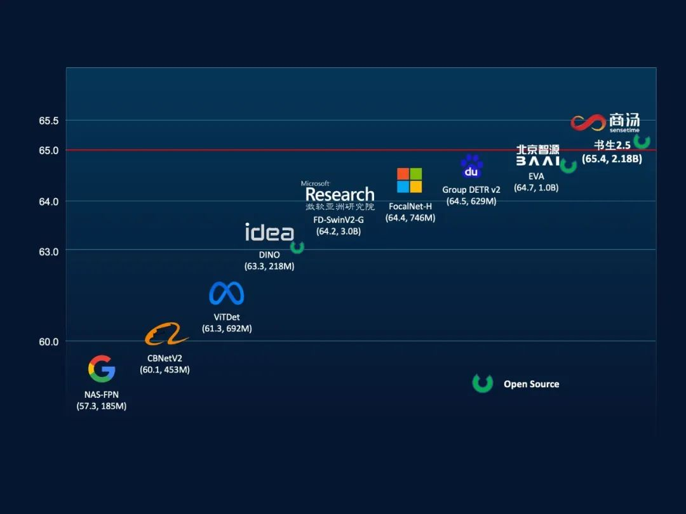
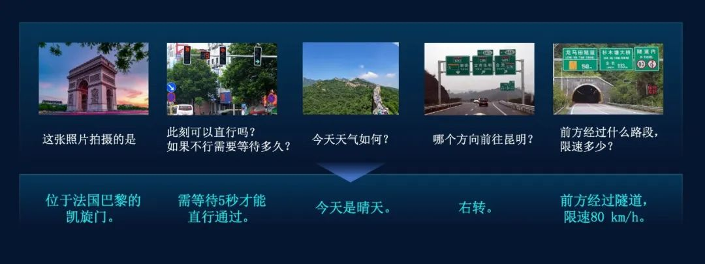
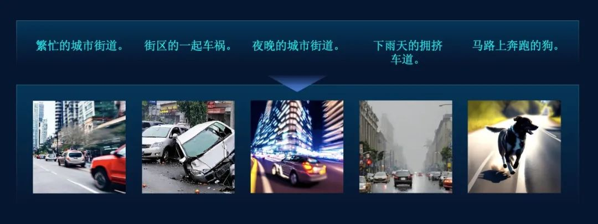
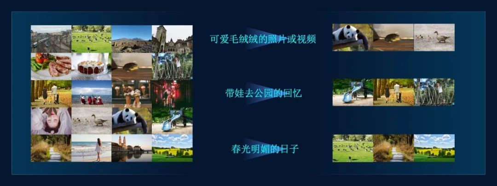

# Intern 2.5 - Multimodal Multitask Universal Large Model
<div align=center>

</div>

[](https://paperswithcode.com/sota/object-detection-on-coco?p=internimage-exploring-large-scale-vision)
[](https://paperswithcode.com/sota/object-detection-on-coco-minival?p=internimage-exploring-large-scale-vision)
[](https://paperswithcode.com/sota/object-detection-on-lvis-v1-0-minival?p=internimage-exploring-large-scale-vision)
[](https://paperswithcode.com/sota/object-detection-on-lvis-v1-0-val?p=internimage-exploring-large-scale-vision)
[](https://paperswithcode.com/sota/object-detection-on-pascal-voc-2007?p=internimage-exploring-large-scale-vision)
[](https://paperswithcode.com/sota/object-detection-on-pascal-voc-2012?p=internimage-exploring-large-scale-vision)
[](https://paperswithcode.com/sota/object-detection-on-openimages-v6?p=internimage-exploring-large-scale-vision)
[](https://paperswithcode.com/sota/object-detection-on-crowdhuman-full-body?p=internimage-exploring-large-scale-vision)
[](https://paperswithcode.com/sota/semantic-segmentation-on-ade20k?p=internimage-exploring-large-scale-vision)
[](https://paperswithcode.com/sota/semantic-segmentation-on-pascal-context?p=internimage-exploring-large-scale-vision)
[](https://paperswithcode.com/sota/semantic-segmentation-on-coco-stuff-test?p=internimage-exploring-large-scale-vision)
[](https://paperswithcode.com/sota/3d-object-detection-on-nuscenes-camera-only?p=bevformer-v2-adapting-modern-image-backbones)
[](https://paperswithcode.com/sota/image-classification-on-inaturalist-2018?p=internimage-exploring-large-scale-vision)
[](https://paperswithcode.com/sota/image-classification-on-places365?p=internimage-exploring-large-scale-vision)
[](https://paperswithcode.com/sota/image-classification-on-places205?p=internimage-exploring-large-scale-vision)
[](https://paperswithcode.com/sota/2d-object-detection-on-bdd100k-val?p=internimage-exploring-large-scale-vision)
[](https://paperswithcode.com/sota/image-classification-on-imagenet?p=internimage-exploring-large-scale-vision)

This repository is an official implementation of the [InternImage: Exploring Large-Scale Vision Foundation Models with
Deformable Convolutions](https://arxiv.org/abs/2211.05778).

[Paper](https://arxiv.org/abs/2211.05778) \| [Blog in Chinese](https://zhuanlan.zhihu.com/p/610772005)


## Intern 2.5- Visual Universal Backbone Model with 3 Billion Parameter
### Introduction
On March 14, 2023, SenseTime and Shanghai AI Laboratory jointly released the multimodal multitask universal model "Intern 2.5". The model achieved multiple breakthroughs in multimodal multitask processing, and its excellent cross-modal task processing ability in text and image can provide efficient and accurate perception and understanding capabilities for general scenarios such as autonomous driving.

### Highlights
- 🏆 **The strongest visual universal backbone model with up to 3 billion parameters**
- 🏆 **Won the "double championship" of ImageNet and COCO**
- 🏆 **The highest accuracy in ImageNet among open-source models**
- 🏆 **Achieved 65.4mAP on the COCO benchmark dataset for object detection, the only model that exceeded 65.0mAP**

### News
- `Mar 14, 2023`: 🚀 Intern 2.5 is released！
- `Feb 28, 2023`: 🚀 InternImage is accepted to CVPR 2023!
- `Nov 18, 2022`: 🚀 InternImage-XL merged into [BEVFormer v2](https://arxiv.org/abs/2211.10439) achieves state-of-the-art performance of `63.4 NDS` on nuScenes Camera Only.
- `Nov 10, 2022`: 🚀 InternImage-H achieves a new record `65.4 mAP` on COCO detection test-dev and `62.9 mIoU` on
ADE20K, outperforming previous models by a large margin.

### Dominating the Visual Benchmark
#### 1. ImageNet
On the mainstream visual image classification dataset ImageNet, "Intern 2.5" achieved a Top-1 accuracy of 90.1% based solely on public data. Except for two unpublished models from Google and Microsoft and additional datasets, this is the only model with an accuracy exceeding 90.0%. It is also the highest accuracy and largest open-source model on ImageNet in the world.

<div align=center>

</div>

#### 2. COCO
On the COCO benchmark for object detection, "Intern 2.5" achieved a mAP of 65.4, which is the only model in the world that exceeded 65.0mAP and has already taken a substantial lead over Google and Microsoft.
<div align=center>

</div>


###  Cross-modal Applications between Text and Images

The "Intern 2.5" multimodal multitask universal model currently focuses on cross-modal tasks between text and images. The model can flexibly and accurately handle various tasks without fine-tuning, and has achieved impressive performance in cross-modal tasks such as "image captioning, text-to-image generation, and image-text retrieval".

#### Image-to-text

"Image-to-text" is a type of task in visual perception that can generate corresponding text based on a given image and a prompt sentence. "Intern 2.5" has strong comprehension ability in image captioning, visual question answering, visual reasoning, and text recognition. For example, in the scenario of autonomous driving, it can significantly improve the scene perception and understanding ability, efficiently and accurately assist the vehicle in judging the traffic signal status, road signs and other information, and provide effective perception information support for vehicle decision-making and planning.

<div align=center>

</div>

#### Text-to-image Generation

"Text-to-image generation" is an important direction in AI Generated Content (AIGC). The "Text-to-image generation" capability of "Shusheng 2.5" can generate high-quality and realistic images that meet the user's creative needs based on the diffusion model generation algorithm. For example, in data-dependent scenarios such as autonomous driving, "Shusheng 2.5" can generate various realistic road traffic scenes, such as busy city streets, crowded lanes in rainy weather, and running dogs on the road, to assist in the development of autonomous driving systems and continuously improve the perception ability of Corner Case scenarios.

<div align=center>

</div>


#### Image and Text Retrieval

"Image-text retrieval" is the ability to retrieve the most semantically relevant images based on text content. "Intern 2.5" has powerful image-text retrieval capabilities, which can be applied to both videos and image collections, and can further combine object detection boxes. It has a rich application mode, helping users to find the desired image resources more conveniently and quickly.

<div align=center>

</div>


### Technologies Introduction
The outstanding performance of "Intern 2.5" in the field of cross-modal learning is due to several innovations in the core technology of multi-modal multi-task universal model, including the development of InternImage as the backbone network for visual perception, LLM as the large-scale text pre-training network for text processing, and Uni-Perceiver as the compatible decoding modeling for multi-task learning.

InternImage, the visual backbone network of "Intern 2.5," has a parameter size of up to 3 billion and can adaptively adjust the position and combination of convolutions based on dynamic sparse convolution operators, providing powerful representations for multi-functional visual perception. Uni-Perceiver, a versatile task decoding model, encodes data from different modalities into a unified representation space and unifies different tasks into the same task paradigm, enabling simultaneous processing of various modalities and tasks with the same task architecture and shared model parameters.


<div align=center>

</div>


### Model and Code Release
- [coming ] InternImage-H(1B)/G(3B)
- [coming ] Model for other downstream tasks. 
- TensorRT inference. 
- Classification code of the InternImage series.
- InternImage-T/S/B/L/XL ImageNet-1k pretrained model.
- InternImage-L/XL ImageNet-22k pretrained model.
- InternImage-T/S/B/L/XL detection and instance segmentation model.
- InternImage-T/S/B/L/XL semantic segmentation model.


<!-- ## InterImage介绍
InterImage网络采用可变形卷积作为核心算子，可以自适应地调整卷积的位置和组合方式，从而为多功能视觉感知提供强大的表示。我们的模型使得从海量数据中学习更强大和鲁棒的大规模参数模型成为可能，其可以作为计算机视觉任务的通用主干网络，从而可以支撑各类计算机视觉任务。 -->


### Performance on Visual Benchmark

**ImageNet Image Classification**

|      name      |   pretrain   | resolution | acc@1 | #param | FLOPs |      22K model      |      1K model       |
| :------------: | :----------: | :--------: | :---: | :-----: | :---: | :-----------------: | :-----------------: |
| InternImage-T  | ImageNet-1K  |  224x224   | 83.5  |   30M   |  5G   |          -          | [ckpt](https://github.com/OpenGVLab/InternImage/releases/download/cls_model/internimage_t_1k_224.pth) \| [cfg](classification/configs/internimage_t_1k_224.yaml) |
| InternImage-S  | ImageNet-1K  |  224x224   | 84.2  |   50M   |  8G   |          -          | [ckpt](https://github.com/OpenGVLab/InternImage/releases/download/cls_model/internimage_s_1k_224.pth) \| [cfg](classification/configs/internimage_s_1k_224.yaml) |
| InternImage-B  | ImageNet-1K  |  224x224   | 84.9  |   97M   |  16G  |          -          | [ckpt](https://github.com/OpenGVLab/InternImage/releases/download/cls_model/internimage_b_1k_224.pth) \| [cfg](classification/configs/internimage_b_1k_224.yaml) |
| InternImage-L  | ImageNet-22K |  384x384   | 87.7  |  223M   | 108G  | [ckpt](https://github.com/OpenGVLab/InternImage/releases/download/cls_model/internimage_l_22k_192to384.pth)            | [ckpt](https://github.com/OpenGVLab/InternImage/releases/download/cls_model/internimage_l_22kto1k_384.pth) \| [cfg](classification/configs/internimage_l_22kto1k_384.yaml) |
| InternImage-XL | ImageNet-22K |  384x384   | 88.0  |  335M   | 163G  | [ckpt](https://github.com/OpenGVLab/InternImage/releases/download/cls_model/internimage_xl_22k_192to384.pth)            | [ckpt](https://github.com/OpenGVLab/InternImage/releases/download/cls_model/internimage_xl_22kto1k_384.pth) \| [cfg](classification/configs/internimage_xl_22kto1k_384.yaml) |
| InternImage-H | ImageNet-22K |  224x224   | 88.9  |  1.08B   | 188G  | -         | - |
| InternImage-H | ImageNet-22K |  640x640   | 89.6  |  1.08B   | 1478G  |-           | - |
| InternImage-G | ImageNet-22K |  640x640   | 90.1  |  3B   | -  |  -       | -|

**COCO Object Detection and Instance Segmentation**

|    backbone    |       method       | schd | box mAP | mask mAP | #param | FLOPs | Download | 
| :------------: | :----------------: | :---------: | :-----: | :------: | :-----: | :---: | :---: | 
| InternImage-T  |     Mask R-CNN     |     1x      |  47.2   |   42.5   |   49M   | 270G  |  [ckpt](https://github.com/OpenGVLab/InternImage/releases/download/det_model/mask_rcnn_internimage_t_fpn_1x_coco.pth) \| [cfg](detection/configs/mask_rcnn/mask_rcnn_internimage_t_fpn_1x_coco.py) |
| InternImage-T  |     Mask R-CNN     |     3x      |  49.1   |   43.7   |   49M   | 270G  |  [ckpt](https://github.com/OpenGVLab/InternImage/releases/download/det_model/mask_rcnn_internimage_t_fpn_3x_coco.pth) \| [cfg](detection/configs/mask_rcnn/mask_rcnn_internimage_t_fpn_3x_coco.py) |
| InternImage-S  |     Mask R-CNN     |     1x      |  47.8   |   43.3   |   69M   | 340G  |  [ckpt](https://github.com/OpenGVLab/InternImage/releases/download/det_model/mask_rcnn_internimage_s_fpn_1x_coco.pth) \| [cfg](detection/configs/mask_rcnn/mask_rcnn_internimage_s_fpn_1x_coco.py) |
| InternImage-S  |     Mask R-CNN     |     3x      |  49.7   |   44.5   |   69M   | 340G  |  [ckpt](https://github.com/OpenGVLab/InternImage/releases/download/det_model/mask_rcnn_internimage_s_fpn_3x_coco.pth) \| [cfg](detection/configs/mask_rcnn/mask_rcnn_internimage_s_fpn_3x_coco.py) |
| InternImage-B  |     Mask R-CNN     |     1x      |  48.8   |   44.0   |  115M   | 501G  |  [ckpt](https://github.com/OpenGVLab/InternImage/releases/download/det_model/mask_rcnn_internimage_b_fpn_1x_coco.pth) \| [cfg](detection/configs/mask_rcnn/mask_rcnn_internimage_b_fpn_1x_coco.py) |
| InternImage-B  |     Mask R-CNN     |     3x      |  50.3   |   44.8   |  115M   | 501G  |  [ckpt](https://github.com/OpenGVLab/InternImage/releases/download/det_model/mask_rcnn_internimage_b_fpn_3x_coco.pth) \| [cfg](detection/configs/mask_rcnn/mask_rcnn_internimage_b_fpn_3x_coco.py) |
| InternImage-L  |     Cascade        |     1x      |  54.9   |   47.7   |  277M   | 1399G |  [ckpt](https://github.com/OpenGVLab/InternImage/releases/download/det_model/cascade_internimage_l_fpn_1x_coco.pth) \| [cfg](detection/configs/cascade_mask_rcnn/cascade_internimage_l_fpn_1x_coco.py) |
| InternImage-L  |     Cascade        |     3x      |  56.1   |   48.5   |  277M   | 1399G |  [ckpt](https://github.com/OpenGVLab/InternImage/releases/download/det_model/cascade_internimage_l_fpn_3x_coco.pth) \| [cfg](detection/configs/cascade_mask_rcnn/cascade_internimage_l_fpn_3x_coco.py) |
| InternImage-XL |     Cascade        |     1x      |  55.3   |   48.1   |  387M   | 1782G |  [ckpt](https://github.com/OpenGVLab/InternImage/releases/download/det_model/cascade_internimage_xl_fpn_1x_coco.pth) \| [cfg](detection/configs/cascade_mask_rcnn/cascade_internimage_xl_fpn_1x_coco.py) |
| InternImage-XL |     Cascade        |     3x      |  56.2   |   48.8   |  387M   | 1782G |  [ckpt](https://github.com/OpenGVLab/InternImage/releases/download/det_model/cascade_internimage_xl_fpn_1x_coco.pth) \| [cfg](detection/configs/cascade_mask_rcnn/cascade_internimage_xl_fpn_3x_coco.py) |
| InternImage-H |     DINO        |     3x      |  65.0   |   -   |  2.18B   | - |  - |
| InternImage-G |     DINO        |     3x      |  65.3   |   -   |  3B   | - |  - |

**ADE20K Semantic Segmentation**

|    backbone    | resolution | single scale | multi scale | #param | FLOPs | Download | 
| :------------: | :--------: | :----------: | :---------: | :-----: | :---: |   :---:  |
| InternImage-T  |  512x512   |     47.9     |    48.1     |   59M   | 944G  | [ckpt](https://github.com/OpenGVLab/InternImage/releases/download/seg_models/upernet_internimage_t_512_160k_ade20k.pth) \| [cfg](segmentation/configs/upernet/upernet_internimage_t_512_160k_ade20k.py) |
| InternImage-S  |  512x512   |     50.1     |    50.9     |   80M   | 1017G | [ckpt](https://github.com/OpenGVLab/InternImage/releases/download/seg_models/upernet_internimage_s_512_160k_ade20k.pth) \| [cfg](segmentation/configs/upernet/upernet_internimage_s_512_160k_ade20k.py) |
| InternImage-B  |  512x512   |     50.8     |    51.3     |  128M   | 1185G | [ckpt](https://github.com/OpenGVLab/InternImage/releases/download/seg_models/upernet_internimage_b_512_160k_ade20k.pth) \| [cfg](segmentation/configs/upernet/upernet_internimage_b_512_160k_ade20k.py) |
| InternImage-L  |  640x640   |     53.9     |    54.1     |  256M   | 2526G | [ckpt](https://github.com/OpenGVLab/InternImage/releases/download/seg_models/upernet_internimage_l_640_160k_ade20k.pth) \| [cfg](segmentation/configs/upernet/upernet_internimage_l_640_160k_ade20k.py) |
| InternImage-XL |  640x640   |     55.0     |    55.3     |  368M   | 3142G | [ckpt](https://github.com/OpenGVLab/InternImage/releases/download/seg_models/upernet_internimage_xl_640_160k_ade20k.pth) \| [cfg](segmentation/configs/upernet/upernet_internimage_xl_640_160k_ade20k.py) |
| InternImage-H |  896x896   |     59.9     |    60.3     |  1.12B   | 3566G | - |

**Main Results of FPS**

|      name      | resolution | #params | FLOPs | Batch 1 FPS(TensorRT) |
| :------------: | :--------: | :-----: | :---: | :-------------------: |
| InternImage-T  |  224x224   |   30M   |  5G   |          156          |
| InternImage-S  |  224x224   |   50M   |  8G   |          129          |
| InternImage-B  |  224x224   |   97M   |  16G  |          116          |
| InternImage-L  |  384x384   |  223M   | 108G  |          56           |
| InternImage-XL |  384x384   |  335M   | 163G  |          47           |


### Citation

If this work is helpful for your research, please consider citing the following BibTeX entry.

```
@article{wang2022internimage,
  title={InternImage: Exploring Large-Scale Vision Foundation Models with Deformable Convolutions},
  author={Wang, Wenhai and Dai, Jifeng and Chen, Zhe and Huang, Zhenhang and Li, Zhiqi and Zhu, Xizhou and Hu, Xiaowei and Lu, Tong and Lu, Lewei and Li, Hongsheng and others},
  journal={arXiv preprint arXiv:2211.05778},
  year={2022}
}

@inproceedings{zhu2022uni,
  title={Uni-perceiver: Pre-training unified architecture for generic perception for zero-shot and few-shot tasks},
  author={Zhu, Xizhou and Zhu, Jinguo and Li, Hao and Wu, Xiaoshi and Li, Hongsheng and Wang, Xiaohua and Dai, Jifeng},
  booktitle={Proceedings of the IEEE/CVF Conference on Computer Vision and Pattern Recognition},
  pages={16804--16815},
  year={2022}
}

@article{zhu2022uni,
  title={Uni-perceiver-moe: Learning sparse generalist models with conditional moes},
  author={Zhu, Jinguo and Zhu, Xizhou and Wang, Wenhai and Wang, Xiaohua and Li, Hongsheng and Wang, Xiaogang and Dai, Jifeng},
  journal={arXiv preprint arXiv:2206.04674},
  year={2022}
}

@article{li2022uni,
  title={Uni-Perceiver v2: A Generalist Model for Large-Scale Vision and Vision-Language Tasks},
  author={Li, Hao and Zhu, Jinguo and Jiang, Xiaohu and Zhu, Xizhou and Li, Hongsheng and Yuan, Chun and Wang, Xiaohua and Qiao, Yu and Wang, Xiaogang and Wang, Wenhai and others},
  journal={arXiv preprint arXiv:2211.09808},
  year={2022}
}
```
