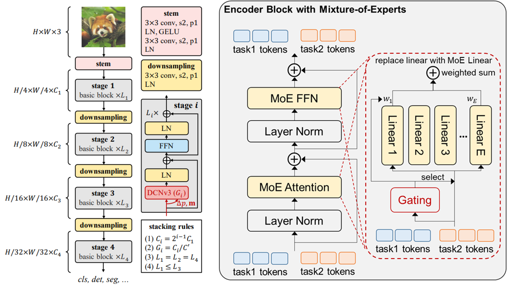

# INTERN-2.5: Multimodal Multitask General Large Model

[](https://paperswithcode.com/sota/object-detection-on-coco?p=internimage-exploring-large-scale-vision)
[](https://paperswithcode.com/sota/object-detection-on-coco-minival?p=internimage-exploring-large-scale-vision)
[](https://paperswithcode.com/sota/object-detection-on-lvis-v1-0-minival?p=internimage-exploring-large-scale-vision)
[](https://paperswithcode.com/sota/object-detection-on-lvis-v1-0-val?p=internimage-exploring-large-scale-vision)
[](https://paperswithcode.com/sota/object-detection-on-pascal-voc-2007?p=internimage-exploring-large-scale-vision)
[](https://paperswithcode.com/sota/object-detection-on-pascal-voc-2012?p=internimage-exploring-large-scale-vision)
[](https://paperswithcode.com/sota/object-detection-on-openimages-v6?p=internimage-exploring-large-scale-vision)
[](https://paperswithcode.com/sota/object-detection-on-crowdhuman-full-body?p=internimage-exploring-large-scale-vision)
[](https://paperswithcode.com/sota/2d-object-detection-on-bdd100k-val?p=internimage-exploring-large-scale-vision)
[](https://paperswithcode.com/sota/semantic-segmentation-on-ade20k?p=internimage-exploring-large-scale-vision)
[](https://paperswithcode.com/sota/semantic-segmentation-on-cityscapes?p=internimage-exploring-large-scale-vision)
[](https://paperswithcode.com/sota/semantic-segmentation-on-cityscapes-val?p=internimage-exploring-large-scale-vision)
[](https://paperswithcode.com/sota/semantic-segmentation-on-pascal-context?p=internimage-exploring-large-scale-vision)
[](https://paperswithcode.com/sota/semantic-segmentation-on-coco-stuff-test?p=internimage-exploring-large-scale-vision)
[](https://paperswithcode.com/sota/3d-object-detection-on-nuscenes-camera-only?p=bevformer-v2-adapting-modern-image-backbones)
[](https://paperswithcode.com/sota/image-classification-on-inaturalist-2018?p=internimage-exploring-large-scale-vision)
[](https://paperswithcode.com/sota/image-classification-on-places365?p=internimage-exploring-large-scale-vision)
[](https://paperswithcode.com/sota/image-classification-on-places205?p=internimage-exploring-large-scale-vision)
[](https://paperswithcode.com/sota/image-classification-on-imagenet?p=internimage-exploring-large-scale-vision)

This repository is an official implementation of the [InternImage: Exploring Large-Scale Vision Foundation Models with
Deformable Convolutions](https://arxiv.org/abs/2211.05778).

[Paper](https://arxiv.org/abs/2211.05778) \| [Blog in Chinese](https://zhuanlan.zhihu.com/p/610772005) | [Documents](./docs/)


## Introduction
SenseTime and Shanghai AI Laboratory jointly released the multimodal multitask general model "INTERN-2.5" on March 14, 2023. "INTERN-2.5" achieved multiple breakthroughs in multimodal multitask processing, and its excellent cross-modal task processing ability in text and image can provide efficient and accurate perception and understanding capabilities for general scenarios such as autonomous driving.

## Overview

<div align=left>

</div>

## Highlights
- :thumbsup: **The strongest visual universal backbone model with up to 3 billion parameters**
- 🏆 **Achieved `90.1% Top1` accuracy in ImageNet, the most accurate among open-source models**
- 🏆 **Achieved `65.5 mAP` on the COCO benchmark dataset for object detection, the only model that exceeded `65.0 mAP`**

## News
- `Mar 14, 2023`: 🚀 "INTERN-2.5" is released！
- `Feb 28, 2023`: 🚀 InternImage is accepted to CVPR 2023!
- `Nov 18, 2022`: 🚀 InternImage-XL merged into [BEVFormer v2](https://arxiv.org/abs/2211.10439) achieves state-of-the-art performance of `63.4 NDS` on nuScenes Camera Only.
- `Nov 10, 2022`: 🚀 InternImage-H achieves a new record `65.4 mAP` on COCO detection test-dev and `62.9 mIoU` on
ADE20K, outperforming previous models by a large margin.

## Applications

### 1. Performance on Image Modality Tasks
- On the ImageNet benchmark dataset, 
"INTERN-2.5" achieved a Top-1 accuracy of 90.1% using only publicly available data for image classification. This is the only model, besides two undisclosed models from Google and Microsoft and additional datasets, to achieve a Top-1 accuracy of over 90.0%. It is also the highest-accuracy open-source model on ImageNet and the largest model in scale in the world.
- On the COCO object detection benchmark dataset, "INTERN-2.5" achieved a mAP of 65.5, making it the only model in the world to surpass 65 mAP.
- "INTERN-2.5" achieved the world's best performance on 16 other important visual benchmark datasets, covering classification, detection, and segmentation tasks.

<div align="left">
<br>
	
**Classification Task**
<table border="1" width="90%">
	<tr align="center">
        <th colspan="1"> Image Classification</th><th colspan="2"> Scene Classification </th><th colspan="1">Long-Tail Classification</th>
    </tr>
    <tr align="center">
        <th>ImageNet</th><th>Places365</th><th>Places 205</th><th>iNaturalist 2018</th>
    </tr>
    <tr align="center">
        <th>90.1</th><th>61.2</th><th>71.7</th><th>92.3</th>
    </tr>
</table>
<br>


**Detection Task**
<table border="1" width="90%">
	<tr align="center">
        <th colspan="4"> Conventional Object Detection</th><th colspan="3">Long-Tail Object Detection </th><th colspan="1">Autonomous Driving Object Detection</th><th colspan="1">Dense Object Detection</th>
    </tr>
    <tr align="center">
        <th>COCO</th><th>VOC 2007</th><th>VOC 2012</th><th>OpenImage</th><th>LVIS minival</th><th>LVIS val</th><th>BDD100K</th><th>nuScenes</th><th>CrowdHuman</th>
    </tr>
    <tr align="center">
        <th>65.5</th><th>94.0</th><th>97.2</th><th>74.1</th><th>65.8</th><th>63.2</th><th>38.8</th><th>64.8</th><th>97.2</th>
    </tr>
</table>
<br>

**Segmentation Task**
<table border="1" width="90%">
	<tr align="center">
        <th colspan="3"> Semantic Segmentation</th><th colspan="1">Street Segmentation</th><th colspan="1">RGBD Segmentation</th>
    </tr>
    <tr align="center">
        <th>ADE20K</th><th>COCO Stuff-10K</th><th>Pascal Context</th><th>CityScapes</th><th>NYU Depth V2</th>
    </tr>
    <tr align="center">
        <th>62.9</th><th>59.6</th><th>70.3</th><th>86.1</th><th>69.7</th>
    </tr>
</table>
<br>

</div>

### 2. Cross-Modal Performance for Image and Text Tasks

- Image-Text Retrieval

"INTERN-2.5" can quickly locate and retrieve the most semantically relevant images based on textual content requirements. This capability can be applied to both videos and image collections and can be further combined with object detection boxes to enable a variety of applications, helping users quickly and easily find the required image resources. For example, it can return the relevant images specified by the text in the album.


- Image-To-Text

"INTERN-2.5" has a strong understanding capability in various aspects of visual-to-text tasks such as image captioning, visual question answering, visual reasoning, and optical character recognition. For example, in the context of autonomous driving, it can enhance the scene perception and understanding capabilities, assist the vehicle in judging traffic signal status, road signs, and other information, and provide effective perception information support for vehicle decision-making and planning.


<div align="left">
<br>
	
**Multimodal Tasks**
<table border="1" width="90%">
	<tr align="center">
        <th colspan="1"> Image Captioning</th><th colspan="2">Fine-tuning Image-Text Retrieval</th><th colspan="1">Zero-shot Image-Text Retrieval</th>
    </tr>
    <tr align="center">
        <th>COCO Caption</th><th>COCO Caption</th><th>Flickr30k</th><th>Flickr30k</th>
    </tr>
    <tr align="center">
        <th>148.2</th><th>76.4</th><th>94.8</th><th>89.1</th>
    </tr>
</table>
<br>

</div>

## Core Technologies
The outstanding performance of "INTERN-2.5" in the field of cross-modal learning is due to several innovations in the core technology of multi-modal multi-task general model, including the development of InternImage as the backbone network for visual perception, LLM as the large-scale text pre-training network for text processing, and Uni-Perceiver as the compatible decoding modeling for multi-task learning.

InternImage, the visual backbone network of "INTERN-2.5", has a parameter size of up to 3 billion and can adaptively adjust the position and combination of convolutions based on dynamic sparse convolution operators, providing powerful representations for multi-functional visual perception. Uni-Perceiver, a versatile task decoding model, encodes data from different modalities into a unified representation space and unifies different tasks into the same task paradigm, enabling simultaneous processing of various modalities and tasks with the same task architecture and shared model parameters.


<div align=left>

</div>


## Project Release
- [ ] Model for other downstream 
tasks
- [x] InternImage-H(1B)/G(3B)
- [x] TensorRT inference
- [x] Classification code of the InternImage series
- [x] InternImage-T/S/B/L/XL ImageNet-1k pretrained model
- [x] InternImage-L/XL ImageNet-22k pretrained model
- [x] InternImage-T/S/B/L/XL detection and instance segmentation model
- [x] InternImage-T/S/B/L/XL semantic segmentation model


## Model Zoo
- Object Detection and Instance Segmentation: [COCO](detection/configs/coco/)
- Semantic Segmentation: [ADE20K](segmentation/configs/ade20k/), [Cityscapes](segmentation/configs/cityscapes/)
- Image-Text Retrieval, Image Captioning, and Visual Question Answering: [Uni-Perceiver](https://github.com/fundamentalvision/Uni-Perceiver)
- 3D Perception: [BEVFormer](https://github.com/fundamentalvision/BEVFormer)


## Performance on Visual Benchmark

**ImageNet Image Classification**

|      name      |   pretrain   | resolution | acc@1 | #param | FLOPs |      22K model      |      1K model       |
| :------------: | :----------: | :--------: | :---: | :-----: | :---: | :-----------------: | :-----------------: |
| InternImage-T  | ImageNet-1K  |  224x224   | 83.5  |   30M   |  5G   |          -          | [ckpt](https://huggingface.co/OpenGVLab/InternImage/resolve/main/internimage_t_1k_224.pth) \| [cfg](classification/configs/internimage_t_1k_224.yaml) |
| InternImage-S  | ImageNet-1K  |  224x224   | 84.2  |   50M   |  8G   |          -          | [ckpt](https://huggingface.co/OpenGVLab/InternImage/resolve/main/internimage_s_1k_224.pth) \| [cfg](classification/configs/internimage_s_1k_224.yaml) |
| InternImage-B  | ImageNet-1K  |  224x224   | 84.9  |   97M   |  16G  |          -          | [ckpt](https://huggingface.co/OpenGVLab/InternImage/resolve/main/internimage_b_1k_224.pth) \| [cfg](classification/configs/internimage_b_1k_224.yaml) |
| InternImage-L  | ImageNet-22K |  384x384   | 87.7  |  223M   | 108G  | [ckpt](https://huggingface.co/OpenGVLab/InternImage/resolve/main/internimage_l_22k_192to384.pth)            | [ckpt](https://huggingface.co/OpenGVLab/InternImage/resolve/main/internimage_l_22kto1k_384.pth) \| [cfg](classification/configs/internimage_l_22kto1k_384.yaml) |
| InternImage-XL | ImageNet-22K |  384x384   | 88.0  |  335M   | 163G  | [ckpt](https://huggingface.co/OpenGVLab/InternImage/resolve/main/internimage_xl_22k_192to384.pth)            | [ckpt](https://huggingface.co/OpenGVLab/InternImage/resolve/main/internimage_xl_22kto1k_384.pth) \| [cfg](classification/configs/internimage_xl_22kto1k_384.yaml) |
| InternImage-H | Joint 427M |  640x640   | 89.6  |  1.08B   | 1478G  |TODO           | [ckpt](https://huggingface.co/OpenGVLab/InternImage/resolve/main/internimage_h_jointto1k_640.pth) \| [cfg](classification/configs/internimage_h_jointto1k_640.yaml) |
| InternImage-G | Joint 427M |  512x512   | 90.1  |  3B   | TODO  |  TODO      | [ckpt](https://huggingface.co/OpenGVLab/InternImage/resolve/main/internimage_g_jointto1k_512.pth) \| [cfg](classification/configs/internimage_g_jointto1k_512.yaml)|


**COCO Object Detection and Instance Segmentation**


|    backbone    |       method       | schd | box mAP  | mask mAP  | #param | FLOPs | Download | 
| :------------: | :----------------: | :---------: | :-----: | :------: | :-----: | :---: | :---: | 
| InternImage-T  |     Mask R-CNN     |     1x      |  47.2   |   42.5   |   49M   | 270G  |  [ckpt](https://huggingface.co/OpenGVLab/InternImage/resolve/main/mask_rcnn_internimage_t_fpn_1x_coco.pth) \| [cfg](detection/configs/coco/mask_rcnn_internimage_t_fpn_1x_coco.py) |
| InternImage-T  |     Mask R-CNN     |     3x      |  49.1   |   43.7   |   49M   | 270G  |  [ckpt](https://huggingface.co/OpenGVLab/InternImage/resolve/main/mask_rcnn_internimage_t_fpn_3x_coco.pth) \| [cfg](detection/configs/coco/mask_rcnn_internimage_t_fpn_3x_coco.py) |
| InternImage-S  |     Mask R-CNN     |     1x      |  47.8   |   43.3   |   69M   | 340G  |  [ckpt](https://huggingface.co/OpenGVLab/InternImage/resolve/main/mask_rcnn_internimage_s_fpn_1x_coco.pth) \| [cfg](detection/configs/coco/mask_rcnn_internimage_s_fpn_1x_coco.py) |
| InternImage-S  |     Mask R-CNN     |     3x      |  49.7   |   44.5   |   69M   | 340G  |  [ckpt](https://huggingface.co/OpenGVLab/InternImage/resolve/main/mask_rcnn_internimage_s_fpn_3x_coco.pth) \| [cfg](detection/configs/coco/mask_rcnn_internimage_s_fpn_3x_coco.py) |
| InternImage-B  |     Mask R-CNN     |     1x      |  48.8   |   44.0   |  115M   | 501G  |  [ckpt](https://huggingface.co/OpenGVLab/InternImage/resolve/main/mask_rcnn_internimage_b_fpn_1x_coco.pth) \| [cfg](detection/configs/coco/mask_rcnn_internimage_b_fpn_1x_coco.py) |
| InternImage-B  |     Mask R-CNN     |     3x      |  50.3   |   44.8   |  115M   | 501G  |  [ckpt](https://huggingface.co/OpenGVLab/InternImage/resolve/main/mask_rcnn_internimage_b_fpn_3x_coco.pth) \| [cfg](detection/configs/coco/mask_rcnn_internimage_b_fpn_3x_coco.py) |
| InternImage-L  |     Cascade        |     1x      |  54.9   |   47.7   |  277M   | 1399G |  [ckpt](https://huggingface.co/OpenGVLab/InternImage/resolve/main/cascade_internimage_l_fpn_1x_coco.pth) \| [cfg](detection/configs/coco/cascade_internimage_l_fpn_1x_coco.py) |
| InternImage-L  |     Cascade        |     3x      |  56.1   |   48.5   |  277M   | 1399G |  [ckpt](https://huggingface.co/OpenGVLab/InternImage/resolve/main/cascade_internimage_l_fpn_3x_coco.pth) \| [cfg](detection/configs/coco/cascade_internimage_l_fpn_3x_coco.py) |
| InternImage-XL |     Cascade        |     1x      |  55.3   |   48.1   |  387M   | 1782G |  [ckpt](https://huggingface.co/OpenGVLab/InternImage/resolve/main/cascade_internimage_xl_fpn_1x_coco.pth) \| [cfg](detection/configs/coco/cascade_internimage_xl_fpn_1x_coco.py) |
| InternImage-XL |     Cascade        |     3x      |  56.2   |   48.8   |  387M   | 1782G |  [ckpt](https://huggingface.co/OpenGVLab/InternImage/resolve/main/cascade_internimage_xl_fpn_1x_coco.pth) \| [cfg](detection/configs/coco/cascade_internimage_xl_fpn_3x_coco.py) |

|    backbone    |       method       |  box mAP (val/test) |  #param  | FLOPs | Download | 
| :------------: | :----------------: |     :---------:     | :------: | :-----: | :---: | 
| InternImage-H  |     DINO (TTA)     |      65.0 / 65.4     |   2.18B  | TODO |  TODO |
| InternImage-G  |     DINO (TTA)     |      65.3 / 65.5     |    3B    | TODO |  TODO |

**ADE20K Semantic Segmentation**


|    backbone    | method     |   resolution | mIoU (ss/ms) | #param | FLOPs | Download | 
| :------------: | :--------: | :--------: | :----------: | :-----: | :---: |   :---:  |
| InternImage-T  |  UperNet   |   512x512   |     47.9 / 48.1     |   59M   | 944G  | [ckpt](https://huggingface.co/OpenGVLab/InternImage/resolve/main/upernet_internimage_t_512_160k_ade20k.pth) \| [cfg](segmentation/configs/ade20k/upernet_internimage_t_512_160k_ade20k.py) |
| InternImage-S  |  UperNet   |  512x512   |     50.1 / 50.9     |   80M   | 1017G | [ckpt](https://huggingface.co/OpenGVLab/InternImage/resolve/main/upernet_internimage_s_512_160k_ade20k.pth) \| [cfg](segmentation/configs/ade20k/upernet_internimage_s_512_160k_ade20k.py) |
| InternImage-B  |  UperNet   |  512x512   |     50.8 / 51.3     |  128M   | 1185G | [ckpt](https://huggingface.co/OpenGVLab/InternImage/resolve/main/upernet_internimage_b_512_160k_ade20k.pth) \| [cfg](segmentation/configs/ade20k/upernet_internimage_b_512_160k_ade20k.py) |
| InternImage-L  |  UperNet   |  640x640   |     53.9 / 54.1     |  256M   | 2526G | [ckpt](https://huggingface.co/OpenGVLab/InternImage/resolve/main/upernet_internimage_l_640_160k_ade20k.pth) \| [cfg](segmentation/configs/ade20k/upernet_internimage_l_640_160k_ade20k.py) |
| InternImage-XL |  UperNet   |  640x640   |     55.0 / 55.3     |  368M   | 3142G | [ckpt](https://huggingface.co/OpenGVLab/InternImage/resolve/main/upernet_internimage_xl_640_160k_ade20k.pth) \| [cfg](segmentation/configs/ade20k/upernet_internimage_xl_640_160k_ade20k.py) |
| InternImage-H |  UperNet   |  896x896   |     59.9 / 60.3     |  1.12B   | 3566G | [ckpt](https://huggingface.co/OpenGVLab/InternImage/resolve/main/upernet_internimage_h_896_160k_ade20k.pth) \| [cfg](segmentation/configs/ade20k/upernet_internimage_h_896_160k_ade20k.py) |
| InternImage-H |  Mask2Former   |  896x896   |     62.5 / 62.9     |  1.31B   | 4635G | TODO | ckpt \| cfg


**Main Results of FPS**

|      name      | resolution | #params | FLOPs | Batch 1 FPS(TensorRT) |
| :------------: | :--------: | :-----: | :---: | :-------------------: |
| InternImage-T  |  224x224   |   30M   |  5G   |          156          |
| InternImage-S  |  224x224   |   50M   |  8G   |          129          |
| InternImage-B  |  224x224   |   97M   |  16G  |          116          |
| InternImage-L  |  384x384   |  223M   | 108G  |          56           |
| InternImage-XL |  384x384   |  335M   | 163G  |          47           |


## Citation

If this work is helpful for your research, please consider citing the following BibTeX entry.

```
@article{wang2022internimage,
  title={InternImage: Exploring Large-Scale Vision Foundation Models with Deformable Convolutions},
  author={Wang, Wenhai and Dai, Jifeng and Chen, Zhe and Huang, Zhenhang and Li, Zhiqi and Zhu, Xizhou and Hu, Xiaowei and Lu, Tong and Lu, Lewei and Li, Hongsheng and others},
  journal={arXiv preprint arXiv:2211.05778},
  year={2022}
}

@inproceedings{zhu2022uni,
  title={Uni-perceiver: Pre-training unified architecture for generic perception for zero-shot and few-shot tasks},
  author={Zhu, Xizhou and Zhu, Jinguo and Li, Hao and Wu, Xiaoshi and Li, Hongsheng and Wang, Xiaohua and Dai, Jifeng},
  booktitle={CVPR},
  pages={16804--16815},
  year={2022}
}

@article{zhu2022uni,
  title={Uni-perceiver-moe: Learning sparse generalist models with conditional moes},
  author={Zhu, Jinguo and Zhu, Xizhou and Wang, Wenhai and Wang, Xiaohua and Li, Hongsheng and Wang, Xiaogang and Dai, Jifeng},
  journal={arXiv preprint arXiv:2206.04674},
  year={2022}
}

@article{li2022uni,
  title={Uni-Perceiver v2: A Generalist Model for Large-Scale Vision and Vision-Language Tasks},
  author={Li, Hao and Zhu, Jinguo and Jiang, Xiaohu and Zhu, Xizhou and Li, Hongsheng and Yuan, Chun and Wang, Xiaohua and Qiao, Yu and Wang, Xiaogang and Wang, Wenhai and others},
  journal={arXiv preprint arXiv:2211.09808},
  year={2022}
}

@article{yang2022bevformer,
  title={BEVFormer v2: Adapting Modern Image Backbones to Bird's-Eye-View Recognition via Perspective Supervision},
  author={Yang, Chenyu and Chen, Yuntao and Tian, Hao and Tao, Chenxin and Zhu, Xizhou and Zhang, Zhaoxiang and Huang, Gao and Li, Hongyang and Qiao, Yu and Lu, Lewei and others},
  journal={arXiv preprint arXiv:2211.10439},
  year={2022}
}

@article{su2022towards,
  title={Towards All-in-one Pre-training via Maximizing Multi-modal Mutual Information},
  author={Su, Weijie and Zhu, Xizhou and Tao, Chenxin and Lu, Lewei and Li, Bin and Huang, Gao and Qiao, Yu and Wang, Xiaogang and Zhou, Jie and Dai, Jifeng},
  journal={arXiv preprint arXiv:2211.09807},
  year={2022}
}

@inproceedings{li2022bevformer,
  title={Bevformer: Learning bird’s-eye-view representation from multi-camera images via spatiotemporal transformers},
  author={Li, Zhiqi and Wang, Wenhai and Li, Hongyang and Xie, Enze and Sima, Chonghao and Lu, Tong and Qiao, Yu and Dai, Jifeng},
  booktitle={ECCV},
  pages={1--18},
  year={2022},
}
```

<div align=left>

</div>
