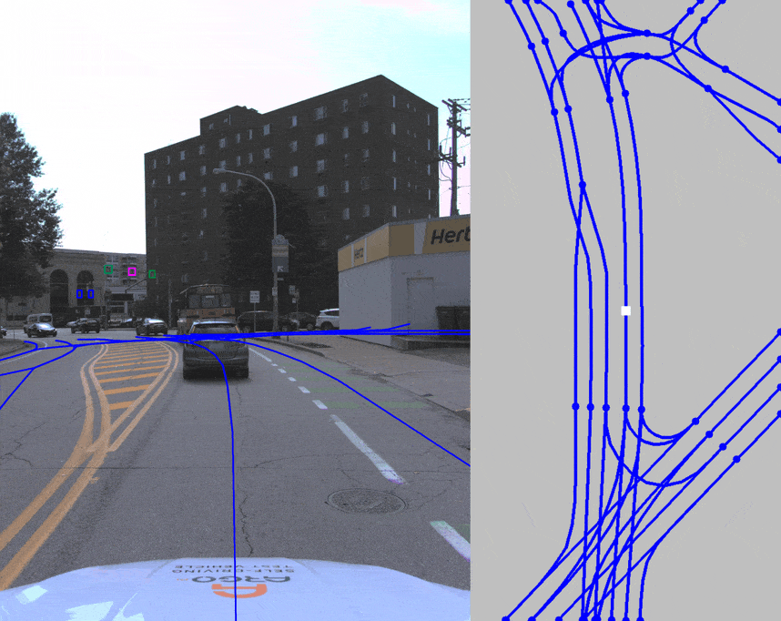
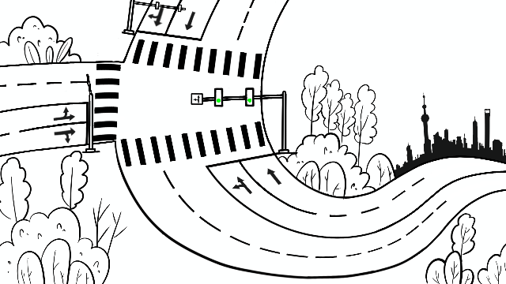
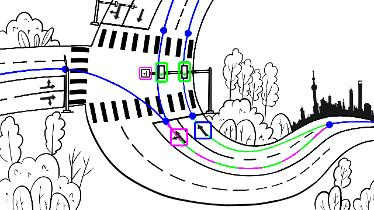

## InternImage-based Baseline for CVPR23 OpenLane-V2 Challenge!!!!

We improve our baseline with a more powerful image backbone: **InternImage**, which shows its excellent ability within a series of leaderboards and benchmarks, such as *COCO* and *nuScenes*.


#### 1. Requirements
```bash
python>=3.8
torch==1.11
mmcv-full>=1.5.2
mmdet==2.28.0
mmsegmentation==0.29.1
timm
```


### 2. Install DCNv3 for InternImage
```bash
cd plugin/mmdet3d/baseline/models/backbones/ops_dcnv3
bash make.sh
```

### 3. Train with InternImage-Small

```bash
./tools/dist_train.sh plugin/mmdet3d/configs/internimage-s.py 8
```

Notes: InternImage provides abundant pre-trained model weights that can be used!!!


### 4. Performance compared to baseline

|             | OpenLane-V2 Score | DET<sub>l</sub> | DET<sub>t</sub> | TOP<sub>ll</sub> | TOP<sub>lt</sub> | F-Score |
|-------------|-------------------|-----------------|-----------------|------------------|------------------|---------|
| base r50    | 0.292             | 0.183           | 0.457           | 0.022            | 0.143            | 0.215   |
| InternImage | 0.325             | 0.194           | 0.537           | 0.02             | 0.17             | 0.224   |

#### Baseline checkpoint

InternImage-S: [download](https://drive.google.com/file/d/1PsyVOEkCdo-q-jxeDKGRjw28_kWWm1d1/view?usp=sharing)

## Leaderboard 
To be released.

<div id="top" align="center">

# OpenLane-V2
**The World's First Perception and Reasoning Benchmark for Scene Structure in Autonomous Driving.**

<a href="#data">
  
</a>
<a href="#devkit">
  
</a>
<a href="#license">
  
</a>

**English | [中文](./README-zh-hans.md)**

_In terms of ambiguity, the English version shall prevail._




</div>

<br>

> The dataset name OpenLane-V2, is termed as **RoadGenome** at Huawei.

## Table of Contents
- [News](#news)
- [Benchmark and Leaderboard](#benchmark-and-leaderboard)
- [Highlight](#highlight---why-we-are-exclusive)
- [Task](#task)
  - [3D Lane Detection 🛣️](#3d-lane-detection-%EF%B8%8F)
  - [Traffic Element Recognition 🚥](#traffic-element-recognition-)
  - [Topology Recognition 🕸️](#topology-recognition-%EF%B8%8F)
- [Data](#data)
- [Devkit](#devkit)
- [Get Started](#get-started)
- [Train a Model](#train-a-model)
- [Citation](#citation)
- [License](#license)

## News
- [2023/03]
  *  We are hosting a Challenge at the [CVPR 2023 Workshop](https://opendrivelab.com/AD23Challenge.html) :star:.
- [2023/02]
  * Dataset `v1.0`: Data of `subset_A` released.
  * Baseline model released.
- [2023/01]
  * Dataset `v0.1`: Initial OpenLane-V2 dataset sample released.
  * Devkit `v0.1.0`: Initial OpenLane-V2 devkit released.

<p align="right">(<a href="#top">back to top</a>)</p>

## Benchmark and Leaderboard
We will provide an initial benchmark on the OpenLane-V2 dataset, please stay tuned for the release.

Currently, we are maintaining leaderboards on the [*val*](https://paperswithcode.com/sota/3d-lane-detection-on-openlane-v2-2) and [*test*](https://eval.ai/web/challenges/challenge-page/1925/leaderboard/4549) split of `subset_A`.


<p align="right">(<a href="#top">back to top</a>)</p>

## Highlight - why we are exclusive?

### The world is three-dimensional - Introducing 3D lane
Previous datasets annotate lanes on images in the perspective view. Such a type of 2D annotation is insufficient to fulfill real-world requirements.
Following the [OpenLane](https://github.com/OpenDriveLab/OpenLane) dataset, we annotate **lanes in 3D space** to reflect their properties in the real world.

### Be aware of traffic signals - Recognizing Extremely Small road elements
Not only preventing collision but also facilitating efficiency is essential. 
Vehicles follow predefined traffic rules for self-disciplining and cooperating with others to ensure a safe and efficient traffic system.
**Traffic elements** on the roads, such as traffic lights and road signs, provide practical and real-time information.

### Beyond perception - Topology Reasoning between lane and road elements 
A traffic element is only valid for its corresponding lanes. 
Following the wrong signals would be catastrophic. 
Also, lanes have their predecessors and successors to build the map. 
Autonomous vehicles are required to **reason** about the **topology relationships** to drive in the right way.
In this dataset, we hope to shed light on the task of **scene structure perception and reasoning**.

### Data scale and diversity matters - building on Top of Awesome Benchmarks
Experience from the sunny day does not apply to the dancing snowflakes.
For machine learning, data is the must-have food.
We provide annotations on data collected in various cities, from Austin to Singapore and from Boston to Miami.
The **diversity** of data enables models to generalize in different atmospheres and landscapes.

<p align="right">(<a href="#top">back to top</a>)</p>

## Task
The primary task of the dataset is **scene structure perception and reasoning**, which requires the model to recognize the dynamic drivable states of lanes in the surrounding environment. 
The challenge of this dataset includes not only detecting lane centerlines and traffic elements but also recognizing the attribute of traffic elements and topology relationships on detected objects.
We define the **[OpenLane-V2 Score (OLS)](./docs/metrics.md#openlane-v2-score)**, which is the average of various metrics covering different aspects of the primary task:

$$
\text{OLS} = \frac{1}{4} \bigg[ \text{DET}_{l} + \text{DET}_{t} + f(\text{TOP}_{ll}) + f(\text{TOP}_{lt}) \bigg].
$$

The metrics of different subtasks are described below.

### 3D Lane Detection 🛣️
The [OpenLane](https://github.com/OpenDriveLab/OpenLane) dataset, which is the first real-world and the largest scaled 3D lane dataset to date, provides lane line annotations in 3D space.
Similarly, we annotate 3D lane centerlines and include the F-Score for evaluating predicted results  of undirected lane centerlines.
Furthermore, we define the subtask of 3D lane detection as detecting directed 3D lane centerlines from the given multi-view images covering the whole horizontal FOV.
The instance-level evaluation metric of average precision $\text{DET}_{l}$ is utilized to measure the detection performance on lane centerlines (l).

<p align="center">
  
</p>

### Traffic Element Recognition 🚥
Traffic elements and their attribute provide crucial information for autonomous vehicles.
The attribute represents the semantic meaning of a traffic element, such as the red color of a traffic light. 
In this subtask, on the given image in the front view, the location of traffic elements (traffic lights and road signs) and their attributes are demanded to be perceived simultaneously.
Compared to typical 2D detection datasets, the challenge is that the size of traffic elements is tiny due to the large scale of outdoor environments.
Similar to the typical 2D detection task, the metric of $\text{DET}_{t}$ is utilized to measure the performance of traffic elements (t) detection averaged over different attributes.

<p align="center">
  
</p>

### Topology Recognition 🕸️
We first define the task of recognizing topology relationships in the field of autonomous driving.
Given multi-view images, the model learns to recognize the topology relationships among lane centerlines and between lane centerlines and traffic elements.
The most similar task is link prediction in the field of graph, in which the vertices are given and only edges are predicted by models.
In our case, both vertices and edges are unknown for the model.
Thus, lane centerlines and traffic elements are needed to be detected first, and then the topology relationships are built.
Adapted from the task of link prediction, $\text{TOP}$ is used for topology among lane centerlines (ll) and between lane centerlines and traffic elements (lt).

<p align="center">
  
</p>

<p align="right">(<a href="#top">back to top</a>)</p>

## Data
The OpenLane-V2 dataset is a large-scale dataset for scene structure perception and reasoning in the field of autonomous driving. 
Following [OpenLane](https://github.com/OpenDriveLab/OpenLane), the first 3D lane dataset, we provide lane annotations in 3D space.
The difference is that instead of lane lines, we annotate lane centerlines, which can be served as the trajectory for autonomous vehicles.
Besides, we provide annotations on traffic elements (traffic lights and road signs) and their attribute, and the topology relationships among lane centerlines and between lane centerlines and traffic elements.

The dataset is divided into two subsets. 
**The `subset_A` serves as the primary subset and is utilized for the coming challenges and leaderboard, in which no external data, including the other subset, is allowed**.
The `subset_B` can be used to test the generalization ability of the model.
For more details, please refer to the corresponding pages: [use of data](./data/README.md), [notes of annotation](./docs/annotation.md), and [dataset statistics](./docs/statistics.md).

[Download](./data/README.md#download) now to discover our dataset!

<p align="right">(<a href="#top">back to top</a>)</p>

## Devkit
We provide a devkit for easy access to the OpenLane-V2 dataset.
After installing the package, the use of the dataset, such as loading images, loading meta data, and evaluating results, can be accessed through the API of `openlanv2`.
For more details on the API, please refer to [devkit](./docs/devkit.md).

<p align="right">(<a href="#top">back to top</a>)</p>


## Get Started
Please follow the steps below to get familiar with the OpenLane-V2 dataset.

1. Run the following commands to install the environment for setting up the dataset:

    ```sh
    git clone https://github.com/OpenDriveLab/OpenLane-V2.git
    cd OpenLane-V2
    conda create -n openlanev2 python=3.8 -y
    conda activate openlanev2
    pip install -r requirements.txt
    python setup.py develop
    ```

2. Use [links](./data/README.md#download) to download data manually from 

    -  OpenDataLab,
    -  Google Drive,
    -  Baidu Yun.

    Then put them into the `data/OpenLane-V2/` folder and unzip them. 
    The resulting folder hierarchy is described [here](./data/README.md#hierarchy).
    Or use the following commands to download example data for a quick glance at the dataset:

    ```sh
    cd data/OpenLane-V2
    wget --load-cookies /tmp/cookies.txt "https://docs.google.com/uc?export=download&confirm=$(wget --quiet --save-cookies /tmp/cookies.txt --keep-session-cookies --no-check-certificate 'https://docs.google.com/uc?export=download&id=1Ni-L6u1MGKJRAfUXm39PdBIxdk_ntdc6' -O- | sed -rn 's/.*confirm=([0-9A-Za-z_]+).*/\1\n/p')&id=1Ni-L6u1MGKJRAfUXm39PdBIxdk_ntdc6" -O OpenLane-V2_sample.tar
    md5sum -c openlanev2.md5
    tar -xvf *.tar
    cd ../..
    ```

3. Run the [tutorial](./tutorial.ipynb) on jupyter notebook to get familiar with the dataset and devkit.

<p align="right">(<a href="#top">back to top</a>)</p>


## Train a Model
Plug-ins to prevail deep learning frameworks for training models are provided to start training models on the OpenLane-V2 dataset.
We appreciate your valuable feedback and contributions to plug-ins on different frameworks.

### mmdet3d

The [plug-in](./plugin/mmdet3d/) to MMDetection3d is built on top of [mmdet3d v1.0.0rc6](https://github.com/open-mmlab/mmdetection3d/tree/v1.0.0rc6) and tested under:
- Python 3.8.15
- PyTorch 1.9.1
- CUDA 11.1
- GCC 5.4.0
- mmcv-full==1.5.2
- mmdet==2.26.0
- mmsegmentation==0.29.1

Please follow the [instruction](https://github.com/open-mmlab/mmdetection3d/blob/v1.0.0rc6/docs/en/getting_started.md) to install mmdet3d.
Assuming OpenLane-V2 is installed under `OpenLane-V2/` and mmdet3d is built under `mmdetection3d/`, create a soft link to the plug-in file:
```
└── mmdetection3d
    └── projects
        ├── example_project
        └── openlanev2 -> OpenLane-V2/plugin/mmdet3d
```
Then you can train or evaluate a model using the config `mmdetection3d/projects/openlanev2/configs/baseline.py`, whose path is replaced accordingly.
Options can be passed to enable supported functions during evaluation, such as `--eval-options dump=True dump_dir=/PATH/TO/DUMP` to save pickle file for submission and `--eval-options visualization=True visualization_dir=/PATH/TO/VIS` for visualization.


<p align="right">(<a href="#top">back to top</a>)</p>


## Citation
Please use the following citation when referencing OpenLane-V2:

```bibtex
@misc{ openlanev2_dataset,
  author = {{OpenLane-V2 Dataset Contributors}},
  title = {{OpenLane-V2: The World's First Perception and Reasoning Benchmark for Scene Structure in Autonomous Driving}},
  url = {https://github.com/OpenDriveLab/OpenLane-V2},
  license = {Apache-2.0},
  year = {2023}
}
```

<p align="right">(<a href="#top">back to top</a>)</p>

## License

Before using the dataset, you should register on the website and agree to the terms of use of the [nuScenes](https://www.nuscenes.org/nuscenes).

Our dataset is built on top of the [nuScenes](https://www.nuscenes.org/nuscenes) and [Argoverse 2](https://www.argoverse.org/av2.html) datasets.
Before using the OpenLane-V2 dataset, you should agree to the terms of use of the [nuScenes](https://www.nuscenes.org/nuscenes) and [Argoverse 2](https://www.argoverse.org/av2.html) datasets respectively.

All code within this repository is under [Apache License 2.0](./LICENSE).

<p align="right">(<a href="#top">back to top</a>)</p>
